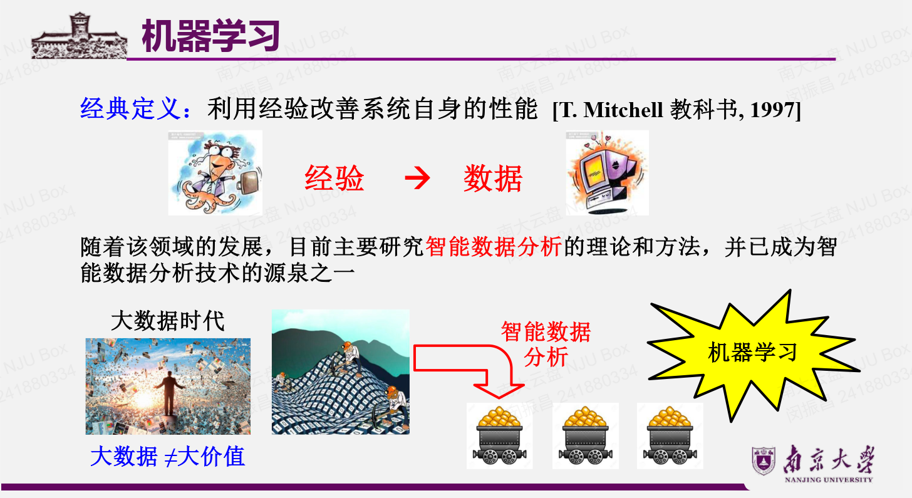
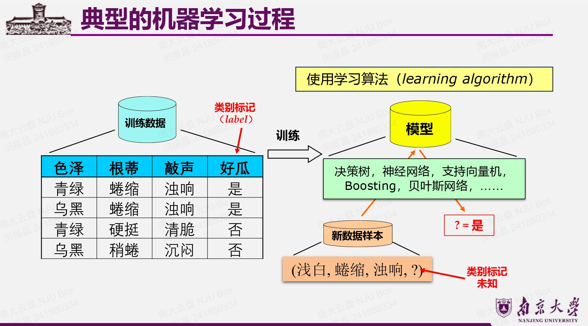
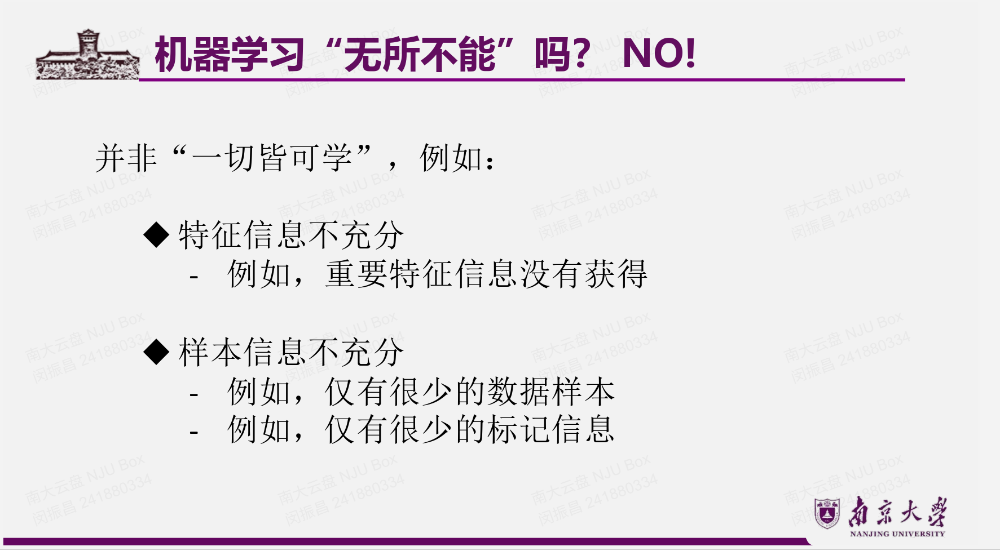
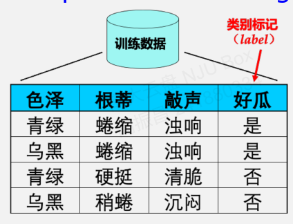
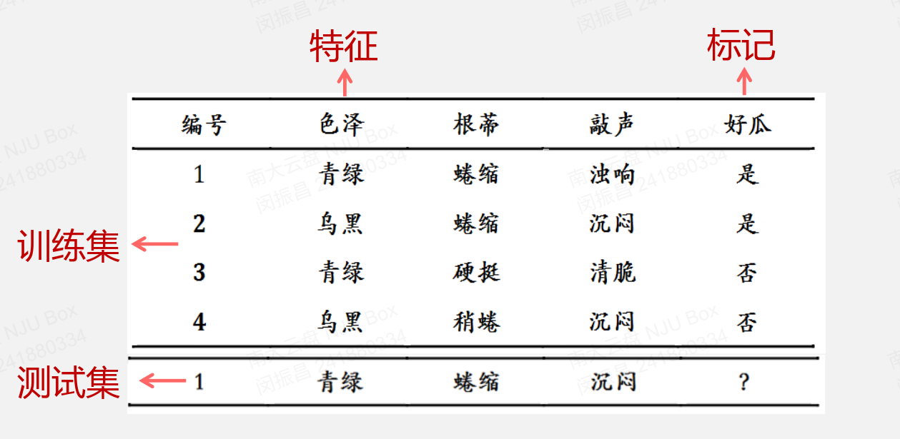
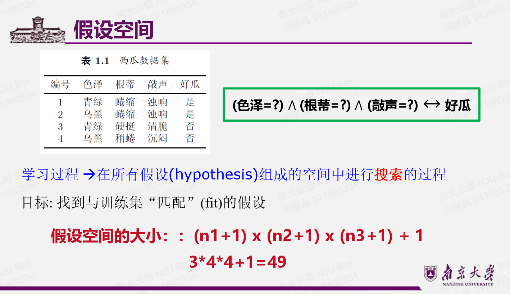
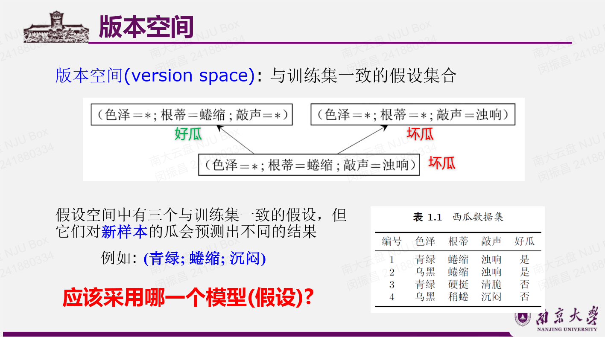
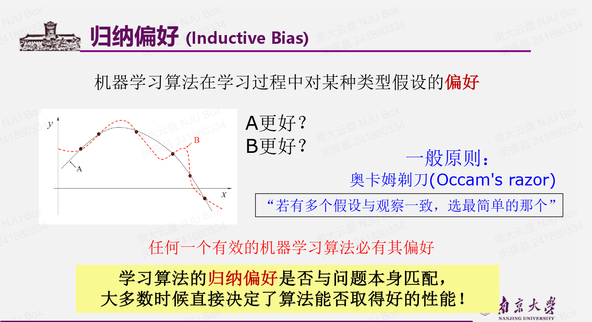
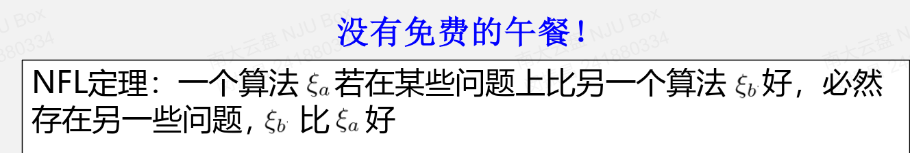
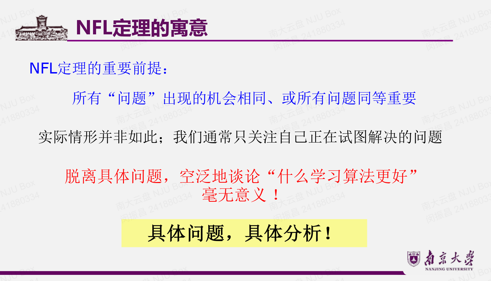

# Lec1:Intro
## 什么是ML

目标任务：判断一个瓜是不是好瓜
来了一个新的数据样本，经过我们训练好的模型，就可以输出目标任务的结果
从**训练数据**中学，就叫拟合
把学到的应用到**测试数据**上，就叫泛化

传统机器学习存在问题，因此需要dl
这个问题就是如果你没有找到所有的与最终输出有关的属性，那么你的输入信息量很可能不足。这是一个需要专家总结评估的过程，必须要给尽量多的与最终输出有关的决定性因素，才能让最终正确率到一定高度。
深度学习DL可以让机器自己学习

最重要的机器学习的理论基础：PAC概率近似正确 model
$$
P(|f(x)-y|\leq\epsilon)\geq 1-\delta
$$

## 基本术语

- 数据集：一般是一个表格，可以分成训练集和测试集
- 示例instance：比如这个表格的一行
- 样例example：在instance基础上加一个输出的属性，比如一个瓜的特征加上他是不是好瓜的一个判断
- 样本sample：可以指示例也可以指样例
- 属性attribute（特征feature）：表头。属性有值，属性值。比如有三个属性，就可以用三维空间来刻画一个瓜的位置。这就是属性空间
- 属性空间/样本空间/输入空间：属性组成的多维空间
- 特征向量：可以指明一个样本点。
- 标记空间/输出空间：目标输出的取值空间，比如是不是好瓜的是/否
- 假设hypothesis
- 真相ground-truth
- 学习器learner：用学习算法得到，把多个学习器集成起来就叫集成学习
- 分类和回归：比如二分类，离散值；回归就是变成(0,1)中的一个连续值的输出
- 监督学习和无监督学习：有无标准监督信息的输入，比如有告诉你是不是好瓜。所以无监督学习只能做聚类，没办法做分类和回归。半监督学习：二者结合，用一些无标注的样本来辅助
- 未见样本：没见过的，也就是不在训练集中的

在某个点的时候，模型的泛化能力会达到最高，而这个时候显然拟合度不是最高。整个机器学习的目的就是找到这个泛化能力最强的点。
后续泛化能力降低，拟合度继续升高，就发生过拟合。在这个点之前就是欠拟合
通常我们假设样本空间中的样本服从一个未知的分布，样本从这个分布中独立获得，独立同分布i.i.d
是说样本的采集是独立的，在同一个分布上采集，采集的样本越多一般更有可能获得强泛化能力的模型

## 假设空间

这个空间的大小是怎么算的？括号里面加1是统配符（比如假设色泽与是不是好瓜无关，那么就是一种新的搭配），最后加1是空集，也就是认为不存在好瓜

### 版本空间
与训练集一致的假设的集合

对于训练集拟合的假设，对新样本会有不同的预测结果，那么应该采用哪一个模型？

## 归纳偏好

这里面的点是训练集样本，我们采用哪一个来作为我们的模型？
归纳偏好决定了我们选择哪一个。

