# 1.生成式AI
## 现在生成式AI可以做到什么
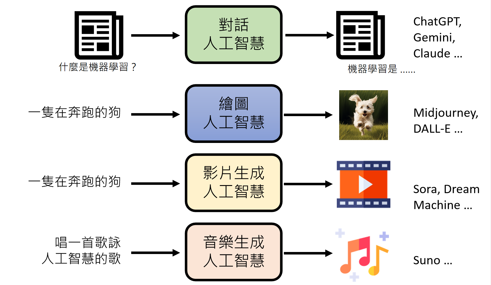
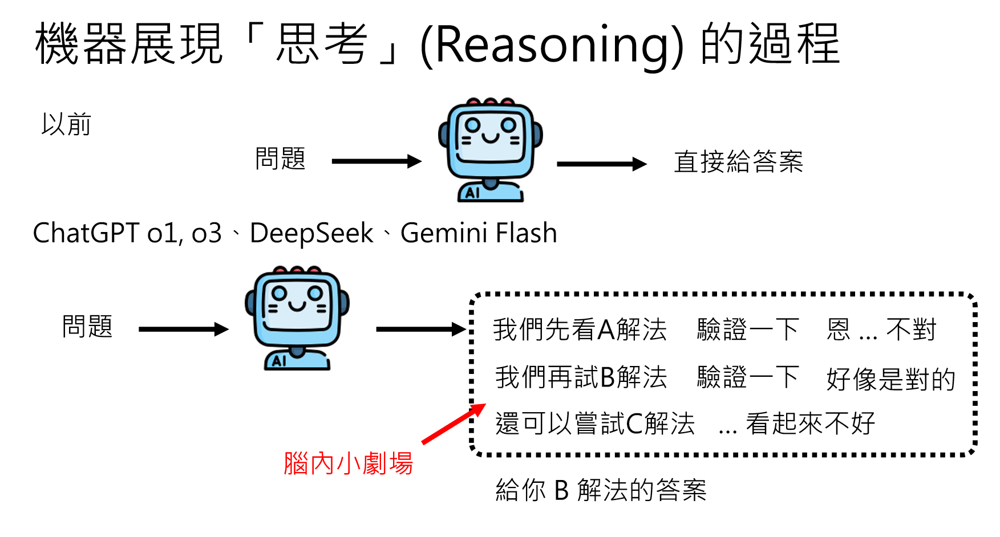

## 生成式AI的基本原理
生成式AI，通过一些复杂的输入，生成一些复杂的输出。
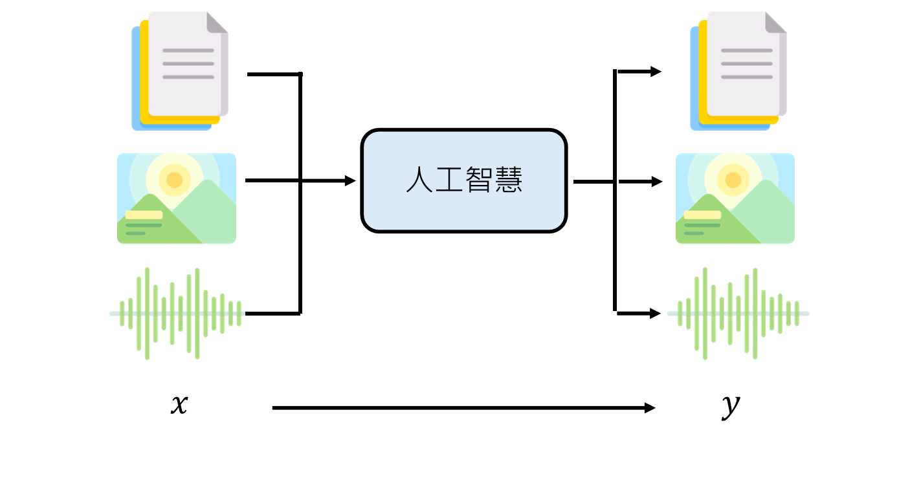
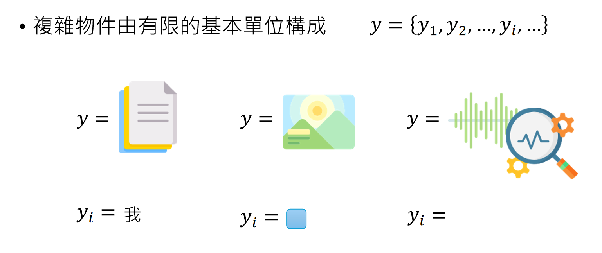
输入一个x，输出一个y，假设y由有限的基本单位组成，比如文字、图片的**像素点**、音频的**采样点**。
那么生成式AI的任务就是学习x和y之间的映射关系。
这样的基本单位叫做**token**。

虽然token的选择是有限的，但是token的组合是无限的。

所有复杂物件都可以写成$\{y_1, y_2, \ldots, y_n\}$的形式。
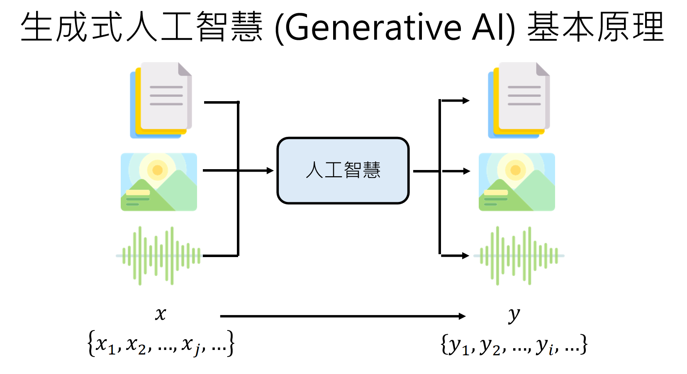
一堆token生成另外一堆token，就是生成式AI的基本原理。

### 策略：根据固定次序，每次只产生一个token，直到生成完所有token。
这个策略叫做 Autoregressive Generation。

x和y没有本质区别，都用z表示。
如果x和y是不同的模态，比如文字和图片，那么就叫做**跨模态生成**，否则叫做**单模态生成**。
这样z是一个新型的模态，新型的token。

### 如何确定下一个token
通过一个函数f，也就是类神经网络，来计算下一个token的概率分布。
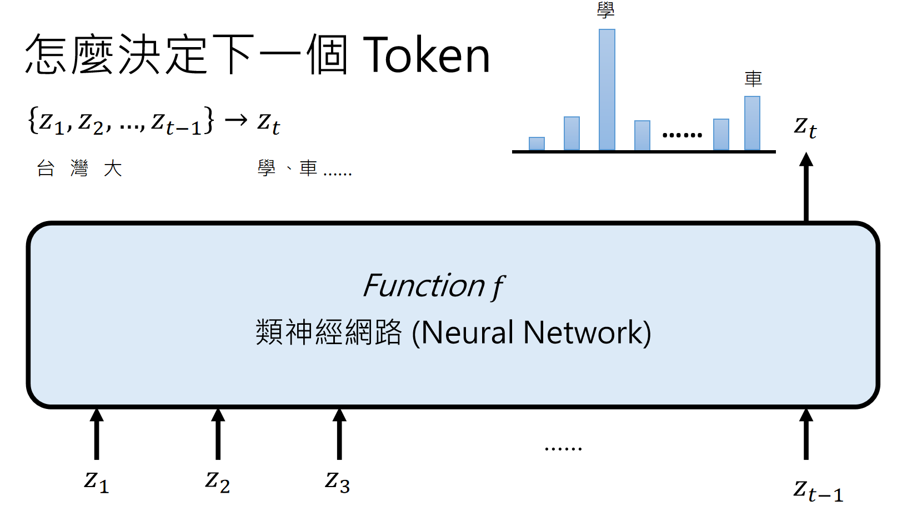
接下来接哪一个token并不是唯一的，所以使用概率分布来表示。
产生概率分布之后，根据这个概率分布去掷骰子，掷出下一个token。

### 类神经网络
把一个函数f拆解成很多个简单的函数f1, f2, ..., fL的组合。
把一個問題拆解成 L(layer 數目) 個步驟串联起来，每个步驟做一个简单的计算。

类神经网络又叫做深度学习模型，深度学习模型的本质就是把一个复杂的函数拆解成很多个简单的函数的组合。
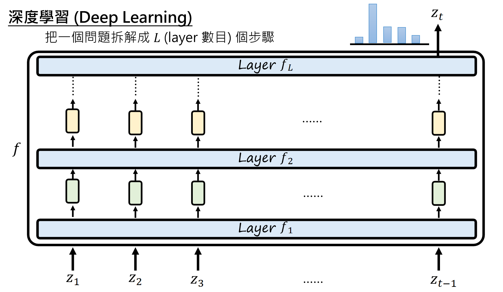
通过每一个layer之后，会产生相应的向量表示。
这些向量表示会传递到下一个layer。

为什么要深度？为什么要拆解成很多个简单的函数？
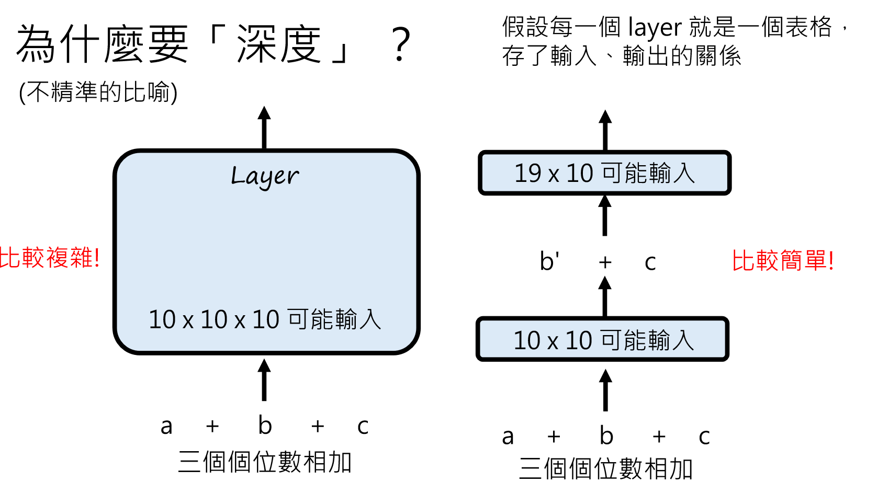

让机器“思考”，演一个脑内小剧场，也是另外一种深度。
通过不断思考，深度不够，长度来凑。
思考长度越长，生成token的质量越高。

一个layer中发生了什么？
一个layer里面，还有很多layer，主要有两种类型的layer。
- 自注意力层（Self-Attention layer）
- 前馈神经网络（Feed-Forward Neural Network）

有self-attention layer和feed-forward neural network交替堆叠而成的深度学习模型，叫做Transformer。
Transformer在输入非常长的时候，运算量可能很大。

有没有其他的类神经网络架构来处理更长的输入？
Mamba

## 运作机制如何产生
类神经网络分为参数和架构两个部分
$$
z_t = f(z_1, z_2, \ldots, z_{t-1})
$$
f可以分为很多个layer，因此
$$
z_t = f_L(...f_2(f_1(z_1, z_2, \ldots, z_{t-1})))
$$
架构是由人类决定的，参数是通过训练数据学习得到的。
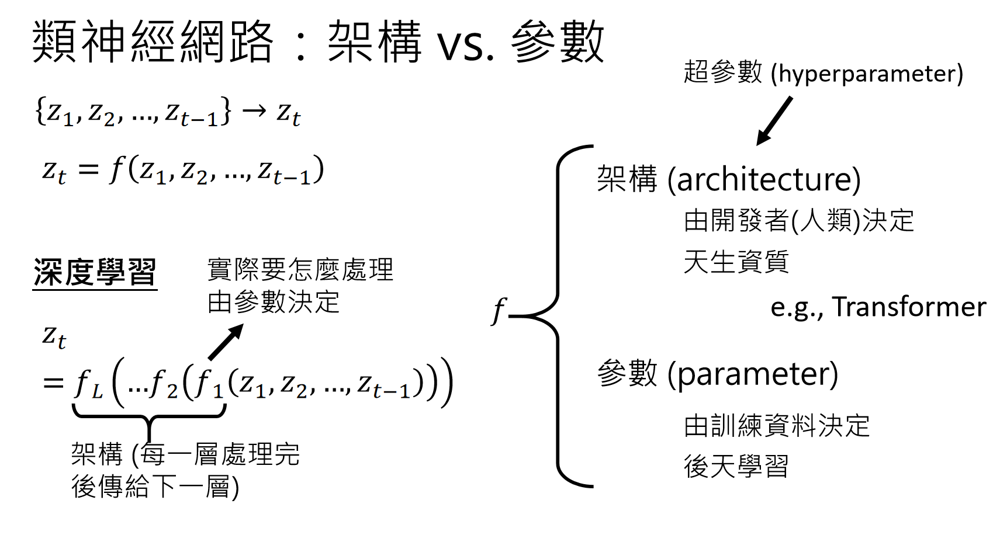
参数数量是架构的一部分，但是架构数值是通过训练数据学习得到的。
用$\theta$表示参数，架构表示为f，那么
$$
z_t = f(z_1, z_2, \ldots, z_{t-1}; \theta)
$$
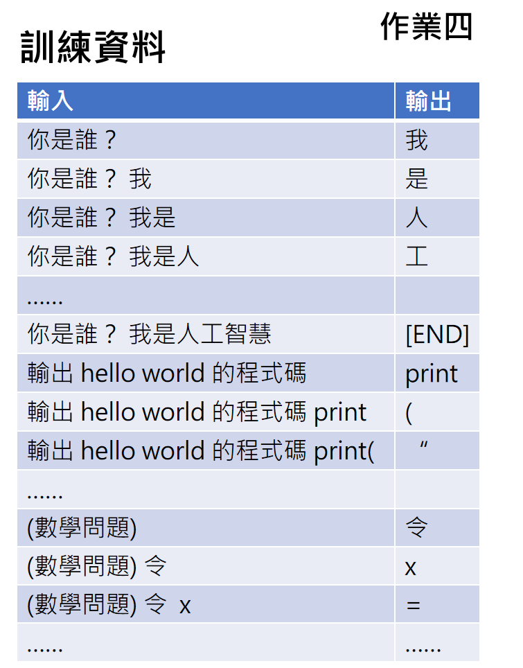
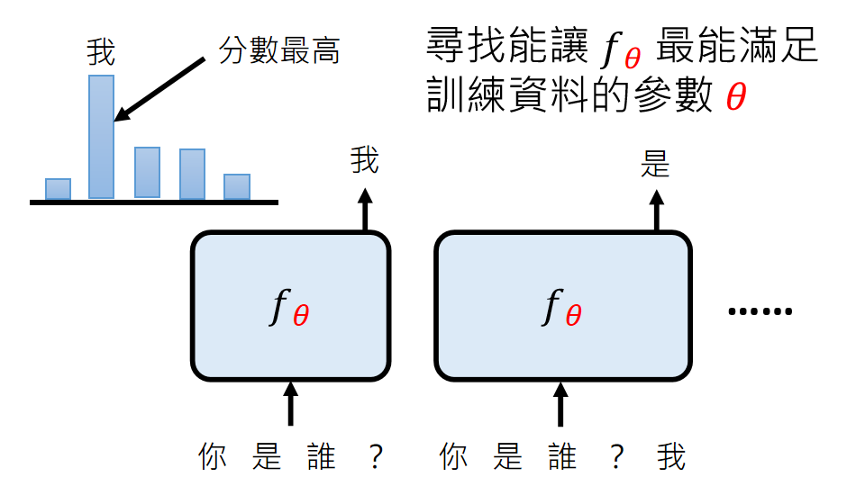

机器学习中的分类（classification）问题
让机器根据输入，预测输出属于哪一类。选择题问题
而生成式AI是一连串选择题问题的集合

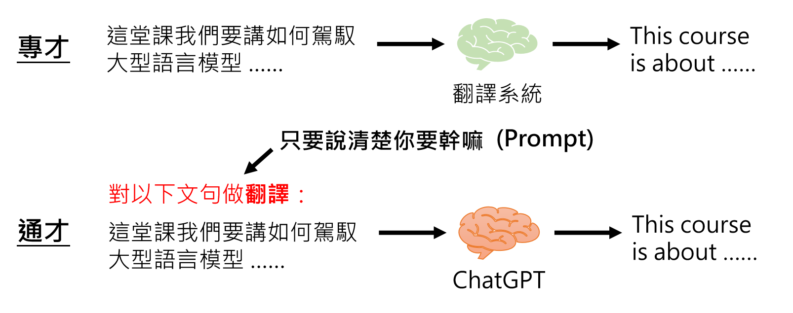
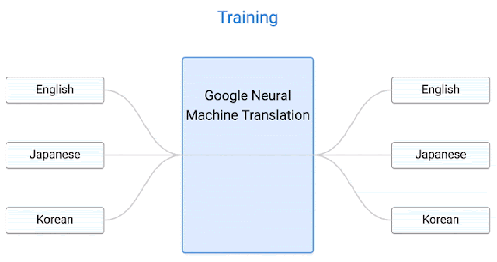
以翻译问题为例，以前的翻译是成对的语言，比如英文和中文，德文和法文
但是这个谷歌的模型，把语言翻译成一种内部语言表示，然后再从这种内部语言表示翻译成另外一种语言
所以说，不同语言是可以共用模型的

那么，不同任务能不能共用模型呢？
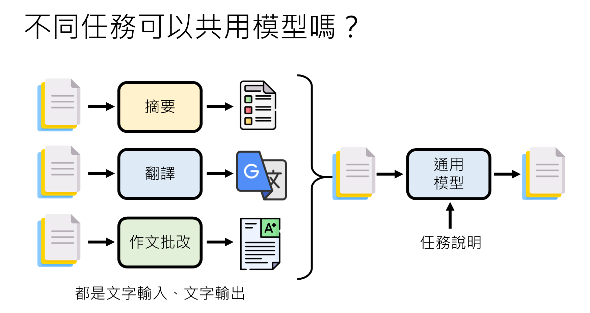

通用模型 第一形态：Encoder
把输入的自然语言输出成向量表示，而不是自然语言
必须要特化的模型来decode成不同的输出

第二形态
有完整的文字输出能力，比如GPT-3
必须把通用模型的参数做微调，才能适应不同的任务
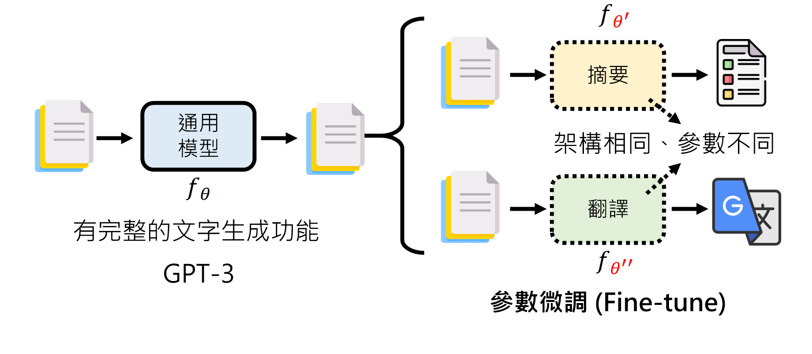

第三形态
按照输入的指令，生成不同任务的输出，不再需要任何调整
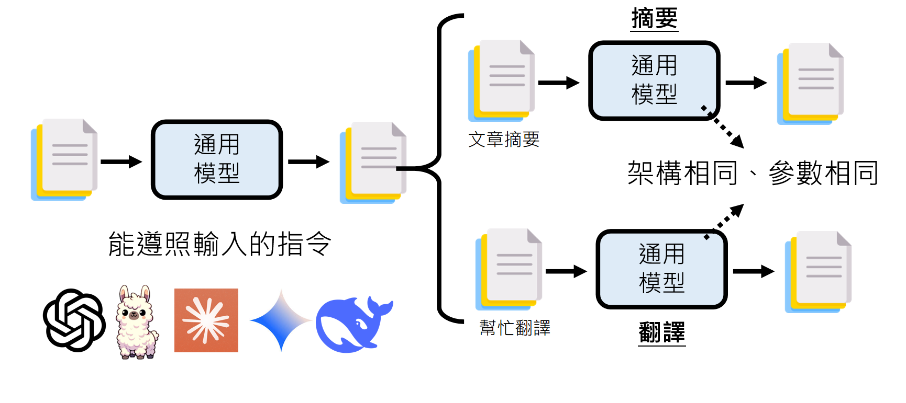

## 怎样赋予新的能力
