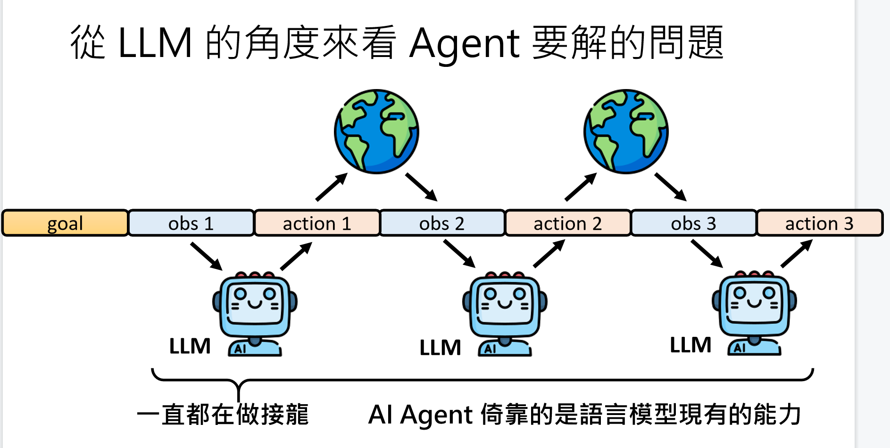
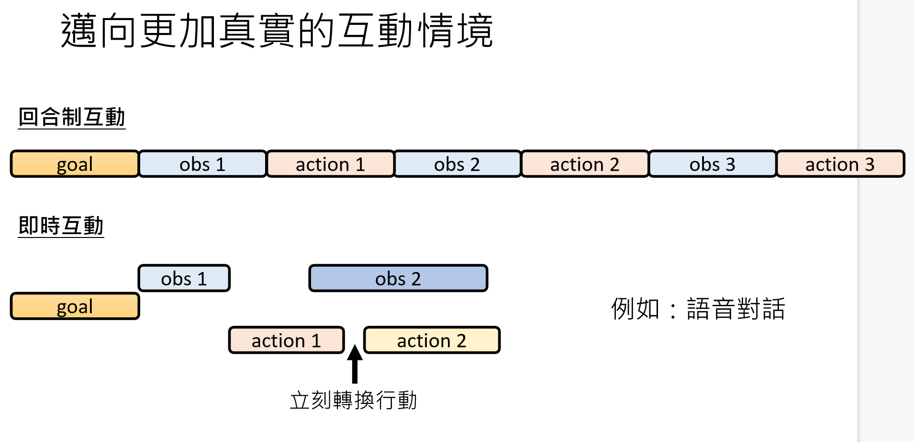
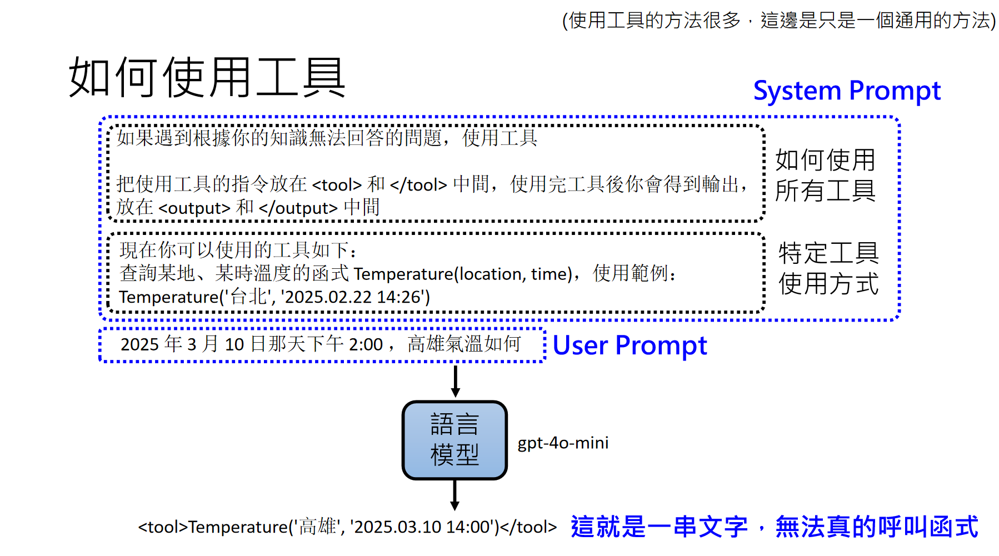
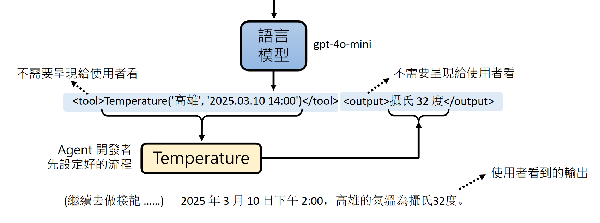

# 2. AI Agent
## AI Agent
人类给目标，AI Agent自己想办法完成，负责实现目标。

对外界观察，然后采取行动，形成一个闭环。
比如下围棋，AI Agent观察棋盘状态，然后采取行动下棋。
这是典型的RL问题，有一个reward反馈，agent要maximize reward。
局限：需要为每一个任务设计专门的RL模型，比较麻烦。
如果用LLM做agent，可以不需要专门设计RL模型。

## AI Agent关键能力
### AI如何根據經驗調整行為
不更新模型的参数，怎么改变模型的行为？
把经验存储下来，作为prompt的一部分，提供给模型。
模型就是文字接龙，输入变了，输出也会变，所以会改变行为。
所以模型不断回顾一生的经验，行为会不断调整。但是算力有限，不能回顾太多经验。

设计一个memory，用read来从memory中只读取与现在任务相关的经验，作为prompt的一部分。
怎么样打造这个read机制？
就是从这个memory这个资料库里面检索相关的经验。
其实就是RAG(Retrieval Augmented Generation)。

所有经验都要存到memory里面吗？
会被鸡毛蒜皮的小事占据，应该要更有效的方式，只记重要资讯
用一个write机制，可以就是agent自己，问自己：这件事重要吗？如果重要，就存到memory里面。
再对记忆中的资讯整理、反思，得到更高层次的经验，存到memory里面。得到的就是knowlwdge graph，知识图谱。

### AI如何使用工具
使用工具又叫做Function Calling。

最常使用的工具：搜尋引擎
用RAG的方式，先搜尋，再把搜尋结果作为prompt的一部分，提供给模型。

### AI如何做计划
强化agent的规划能力，可以暴力搜索
但是暴力搜索会很慢，算力要求高。
所以可以把看起来没希望的分支剪掉，叫做剪枝(pruning)。
但是有些分支看起来没希望，实际上是有希望的，剪掉就错过了。
因为很多任务没办法回溯
所以在脑内模拟，先想好计划，再执行。
Reasoning就是在脑内模拟。
需要一个world model，来模拟外界环境，在脑内模拟行动的结果。