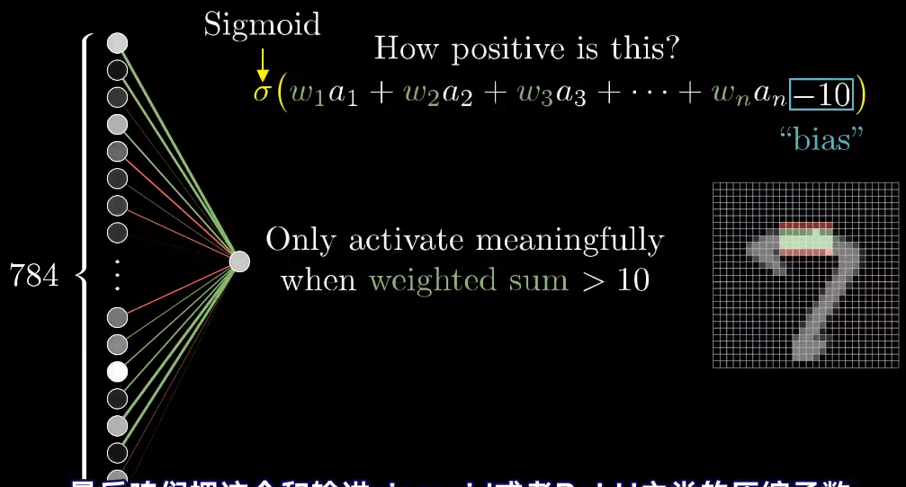
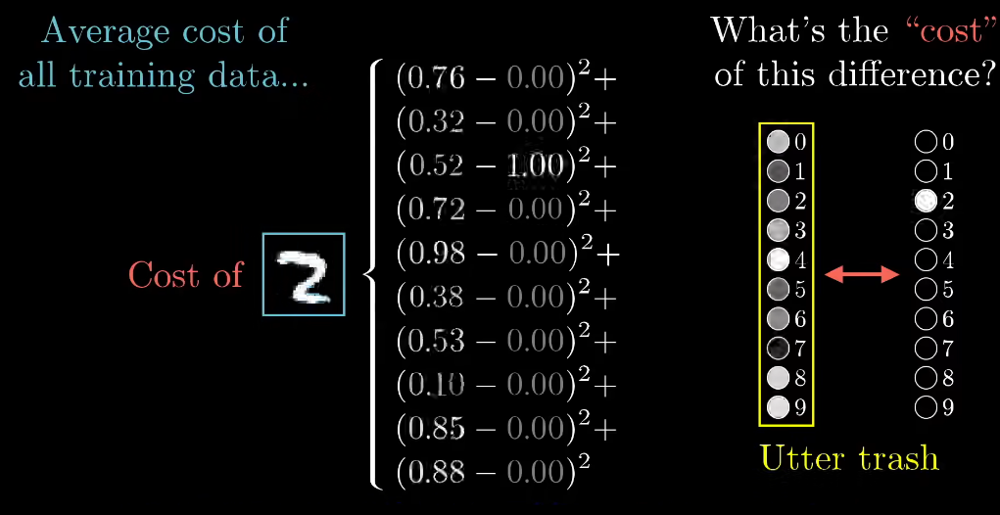

# Neural Network Notes
## Neural Networks
can be viewed as a function that takes in an input and produces an output. The function is defined by a set of parameters (weights and biases) that are learned during training.

## Classic Example: MNIST
MNIST is a dataset of handwritten digits. The task is to classify the images into one of 10 classes (0-9). A simple neural network for this task might consist of an input layer, one hidden layer, and an output layer.
- Input layer: 784 neurons (28x28 pixels), each contains a number between 0 and 1 representing the intensity of the pixel
- Hidden layer: 128 neurons
- Output layer: 10 neurons (one for each class), each contains a number between 0 and 1 representing the probability of the input belonging to that class, so we wish only one exact number to be 1 and the rest to be 0

Each neuron in the hidden layer takes a **weighted sum** of the inputs, applies an **activation function** (e.g., ReLU), adds a bias term, and passes the result to the output layer.


## Cost Function
The cost function (or loss function) measures **how well** the neural network is performing. For classification tasks, a common cost function is the **cross-entropy loss**. The goal of training is to **minimize** this cost function by adjusting the weights and biases of the network.

For the MNIST example, the cost function takes in all the weights and biases of the network and the training data, and outputs a single number that represents the cost. 
The training process involves using an optimization algorithm (e.g., gradient descent) to find the weights and biases that minimize this cost function.

As shown above, we can define the cost function as an average of the gap between the predicted and actual values over all training examples.

We need to minimize the cost function, which is a function of the weights and biases, to find the **optimal parameters** for the neural network.

To do this, we can use an optimization algorithm like **gradient descent**, which iteratively updates the weights and biases in the direction that reduces the cost function.

## Gradient Descent
Gradient of a function indicates the direction of the steepest ascent. To minimize the cost function, we need to move in the **opposite direction** of the gradient. The update rule for gradient descent is:
```
w = w - learning_rate * gradient
b = b - learning_rate * gradient
```
Where `w` and `b` are the weights and biases, `learning_rate` is a hyperparameter that controls the step size of the updates, and `gradient` is the gradient of the cost function with respect to the weights and biases.

And if at some point the gradient is $\begin{bmatrix}1\\3\end{bmatrix}$, it means the second component is larger than the first component, so we should update the weights and biases more along the second component than the first component to minimize the cost function effectively.

## Backpropagation
Backpropagation is the algorithm used to compute the gradients of the cost function with respect to the weights and biases in a neural network. It works by applying the chain rule of calculus to propagate the error from the output layer back through the hidden layers to the input layer.